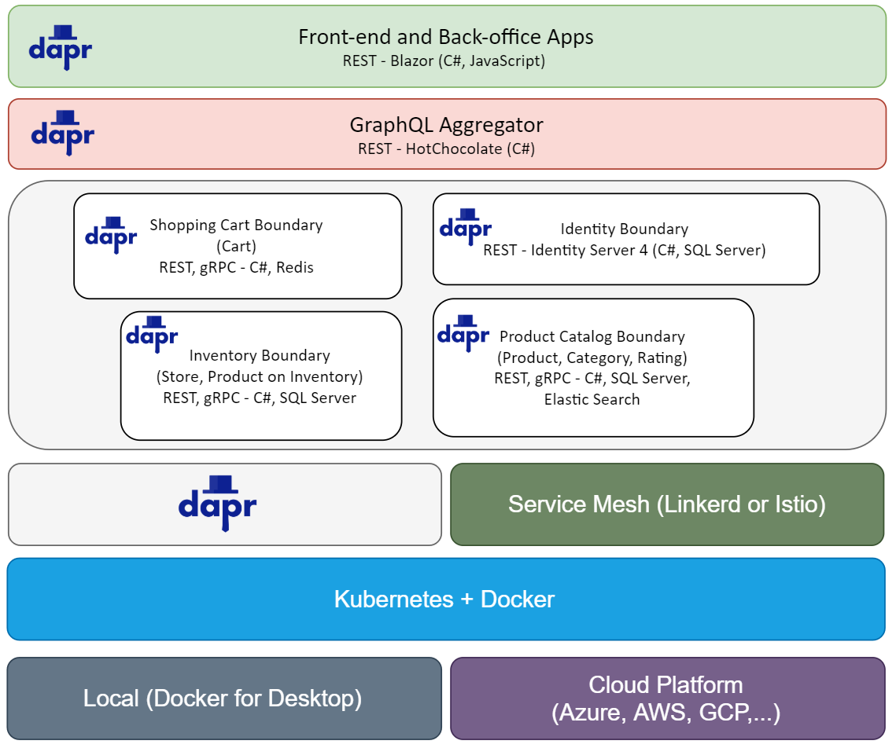

# practical-dapr project

A lightweight low ceremony microservices without Docker, Docker-compose and Helm chart files are lifted and shifted the cloud-native apps to Kubernetes platform and run on Dapr runtime.

## Show your support

If you liked `practical-dapr` project or if it helped you, please give a star :star: for this repository. That will not only help strengthen our .NET community but also improve cloud-native apps development skills for .NET developers in around the world. Thank you very much :+1:

# CoolStore application

# High level architecture

# **Don't believe it, check yourself at [Developer Guidance](/docs/developer_guide.md)**.

## Contributing

1. Fork it!
2. Create your feature branch: `git checkout -b my-new-feature`
3. Commit your changes: `git commit -am 'Add some feature'`
4. Push to the branch: `git push origin my-new-feature`
5. Submit a pull request :p