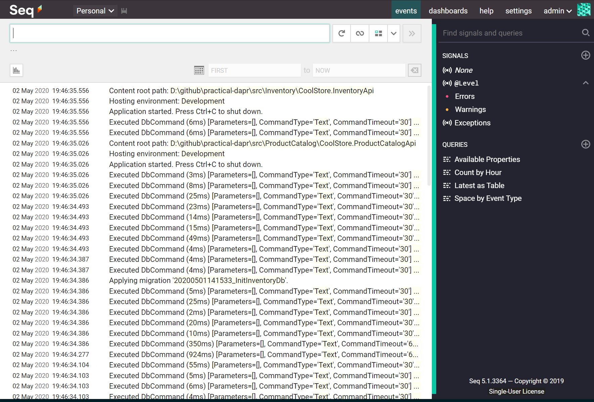
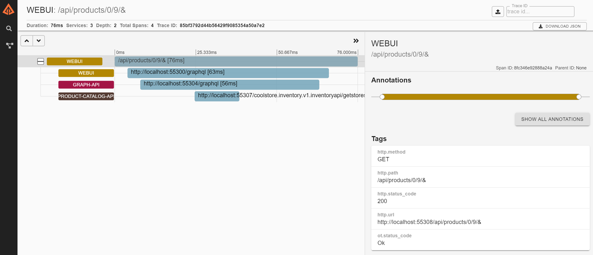

# practical-dapr project

A lightweight low ceremony .NET microservices are lifted and shifted to Kubernetes platform and run on Dapr runtime (with and without Tye options).

[](https://github.com/thangchung/practical-dapr/blob/master/LICENSE)


# High level architecture


# CoolStore demo application


> Want to develop this application? Reference at [Developer Guidance](/docs/developer_guide.md)

> Want to deployment this application? Reference at [Deployment Guidance](/docs/deployment_guide.md)

# Dapr building blocks

## Service to service

- Dapr client to calling to another service (`product-catalog-api` to `inventory-api`)
- HTTP/gRPC invocation

## State store

- Using state management to store the shopping cart data and its items
- Redis for state management

## Pub/sub message

- Create, update and delete a project at `product-catalog-api`, and subsequently publish an event to `inventory-api` to create `price`, `rop`, and `eoq`
- Redis for pub/sub

## Input/output binding

TODO

## Observability

- Run `tye` command as following

```bash
$ tye run --dtrace zipkin=http://localhost:9411 --logs seq=http://localhost:5340
```

- Log management with Seq dashboard



- Distributed Tracing with Zipkin dashboard (OpenTelemetry)



> Technical stack is at [technical_stack](/docs/technical_stack.md)

## Show your support

If you liked `practical-dapr` project or if it helped you, please give a star :star: for this repository. That will not only help strengthen our .NET community but also improve cloud-native apps development skills for .NET developers in around the world. Thank you very much :+1:

## Contributing

1. Fork it!
2. Create your feature branch: `git checkout -b my-new-feature`
3. Commit your changes: `git commit -am 'Add some feature'`
4. Push to the branch: `git push origin my-new-feature`
5. Submit a pull request :p