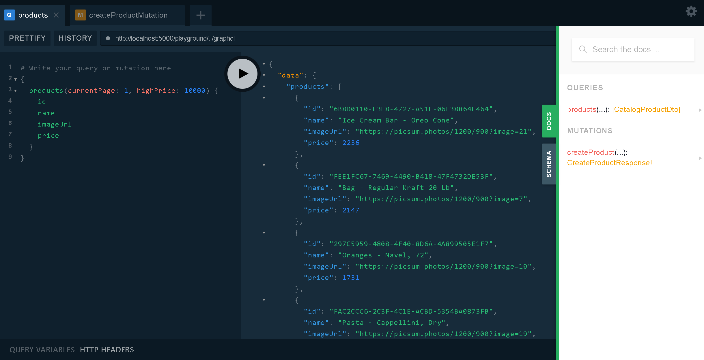

# practical-dapr
Practical Dapr on Coolstore business model


# High Level Architecture


# Get starting

## 1. Manual run with Visual Studio or Visual Code

### Step 1

```bash
$ docker-compose -f docker-compose.yml -f docker-compose.override.yml run sqlserver
```

### Step 2

```bash
$ dotnet run -p \src\GraphApi\CoolStore.GraphApi\CoolStore.GraphApi.csproj
$ dotnet run -p \src\ProductCatalog\CoolStore.ProductCatalogApi\CoolStore.ProductCatalogApi.csproj
```

## 2. Run with Dapr

- Follow those steps at https://github.com/dapr/cli to install Dapr CLI

### Step 1

```bash
$ cd src\ProductCatalog\CoolStore.ProductCatalogApi
$ dapr run --app-id product-catalog-api --port 5002 --grpc-port 15002 dotnet run
```

```bash
$ cd src\GraphApi\CoolStore.GraphApi
$ dapr run --app-id graphql-api --port 5000 dotnet run
```

## 3. Test it

- Go to http://localhost:5000

- Query

```js
query {
    products(currentPage: 1, highPrice: 1000) {
    id
    name
    imageUrl
  }
}
```

- Mutation

```js
mutation createProductMutation($createProductInput: CreateProductInput!) {
  createProduct(createProductInput: $createProductInput) {
    product {
      id
      name
    }
  }
}
```

```js
{
  "createProductInput": {
    "name": "product 1",
    "description": "this is a description",
    "imageUrl": "https://picsum.photos/1200/900?image=100",
    "price": 100,
    "categoryId": "77666AA8-682C-4047-B075-04839281630A",
    "inventoryId": "88ef3cab-5f7e-4111-b151-3fe0d9c20733"
  }
}
```



# Best reference articles
- https://andrewlock.net/sharing-appsettings-json-configuration-files-between-projects-in-asp-net-core/
