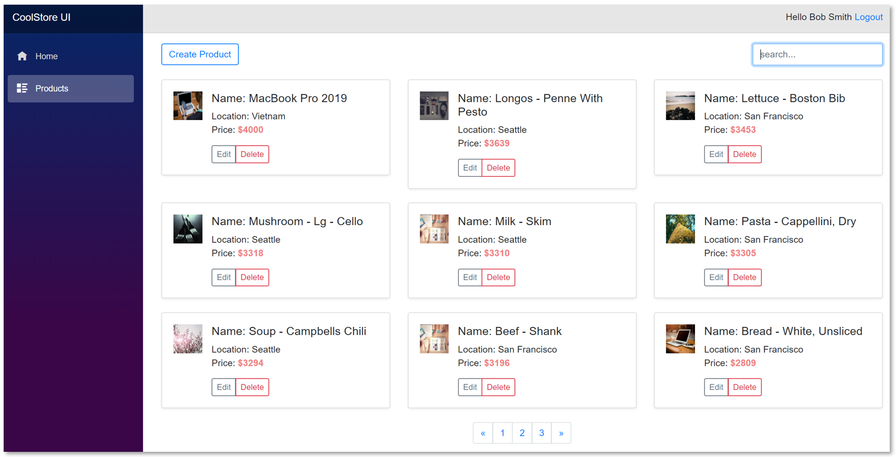

# practical-dapr project

A lightweight low ceremony microservices without Docker, Docker-compose and Helm chart files are lifted and shifted the cloud-native apps to Kubernetes platform and run on Dapr runtime.

[](https://github.com/thangchung/practical-dapr/blob/master/LICENSE)


## Show your support

If you liked `practical-dapr` project or if it helped you, please give a star :star: for this repository. That will not only help strengthen our .NET community but also improve cloud-native apps development skills for .NET developers in around the world. Thank you very much :+1:

# CoolStore application



# High level architecture


# Technical Stack

## Infrastructure

- **`Windows 10`** - the OS for developing and building this demo application.
- **[`Windows subsystem Linux - Ubuntu OS`](https://docs.microsoft.com/en-us/windows/wsl/install-win10)** - the subsystem that helps to run easily the bash shell on Windows OS.
- **[`Docker for desktop (Kubernetes enabled)`](https://www.docker.com/products/docker-desktop)** - the easiest tool to run Docker, Docker Swarm and Kubernetes on Mac and Windows.
- **[`Kubernetes`](https://kubernetes.io) / [`AKS`](https://docs.microsoft.com/en-us/azure/aks)** - the app is designed to run on Kubernetes (both locally on "Docker for Desktop", as well as on the cloud with AKS).
- **[`Dapr`](https://github.com/dapr/dapr)** - Portable, event-driven, runtime for building distributed applications across cloud and edge.
- **[`Tye`](https://github.com/dotnet/tye)** - Tool that makes developing, testing, and deploying microservices and distributed applications easier. Project Tye includes a local orchestrator to make developing microservices easier and the ability to deploy microservices to Kubernetes with minimal configuration.
  
## Back-end

- **[`ASP.NET Core`](https://github.com/dotnet/aspnetcore)** - Cross-platform .NET framework for building modern cloud-based web applications on Windows, Mac, or Linux
- **[`IdentityServer4`](https://github.com/IdentityServer/IdentityServer4)** - OpenID Connect and OAuth 2.0 Framework for ASP.NET Core
- **[`grpc-dotnet`](https://github.com/grpc/grpc-dotnet)** - High-performance, open-source universal RPC framework
- **[`featherhttp`](https://github.com/featherhttp/framework)** - Lightweight low ceremony API for web services
- **[`dapr-dotnet`](https://github.com/dapr/dotnet-sdk)** - Dapr SDK for .NET
- **[`FluentValidation`](https://github.com/FluentValidation/FluentValidation)** - Popular .NET validation library for building strongly-typed validation rules
- **[`MediatR`](https://github.com/jbogard/MediatR)** - Simple, unambitious mediator implementation in .NET
- **[`hotchocolate`](https://github.com/ChilliCream/hotchocolate)** - Hot Chocolate GraphQL server for .NET
- **[`efcore`](https://github.com/dotnet/efcore)** - Modern object-database mapper for .NET. It supports LINQ queries, change tracking, updates, and schema migrations
- **[`Scrutor`](https://github.com/khellang/Scrutor)** - Assembly scanning and decoration extensions for Microsoft.Extensions.DependencyInjection
- **[`serilog`](https://github.com/serilog/serilog)** - Simple .NET logging with fully-structured events

## Front-end

- **[`Blazor`](https://github.com/dotnet/aspnetcore/tree/master/src/Components)** - Client web apps with C#
- **[`StrawberryShake`](https://github.com/ChilliCream/hotchocolate)** - The Strawberry Shake GraphQL client for .NET

# Get starting

One command to rule them all

```bash
$ tye run
```

Want to develop this application? Reference at [Developer Guidance](/docs/developer_guide.md)

Want to deployment this application? Reference at [Deployment Guidance](/docs/deployment_guide.md)

## Contributing

1. Fork it!
2. Create your feature branch: `git checkout -b my-new-feature`
3. Commit your changes: `git commit -am 'Add some feature'`
4. Push to the branch: `git push origin my-new-feature`
5. Submit a pull request :p