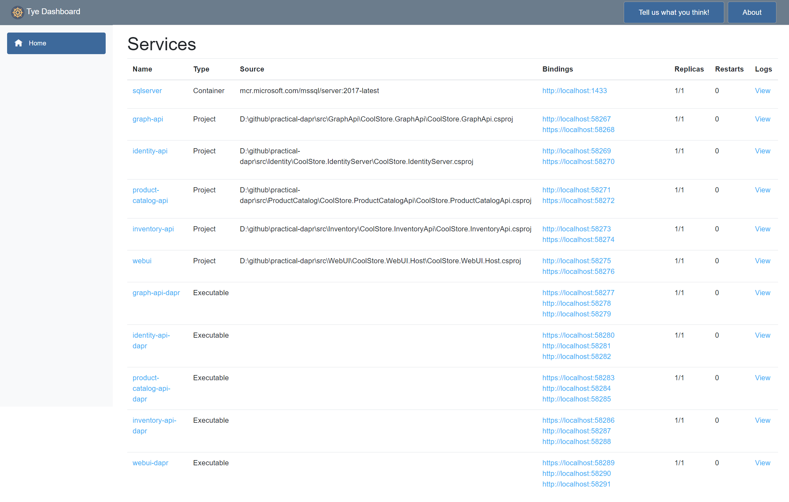
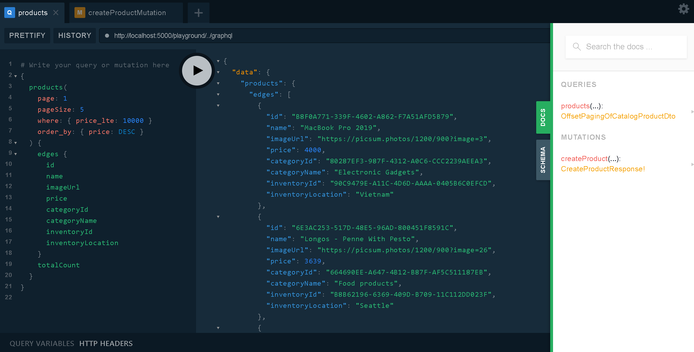
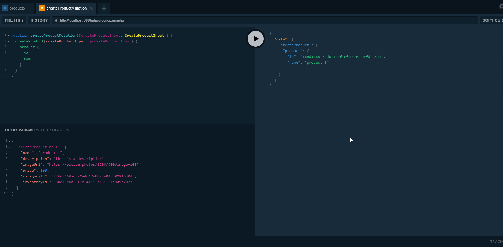
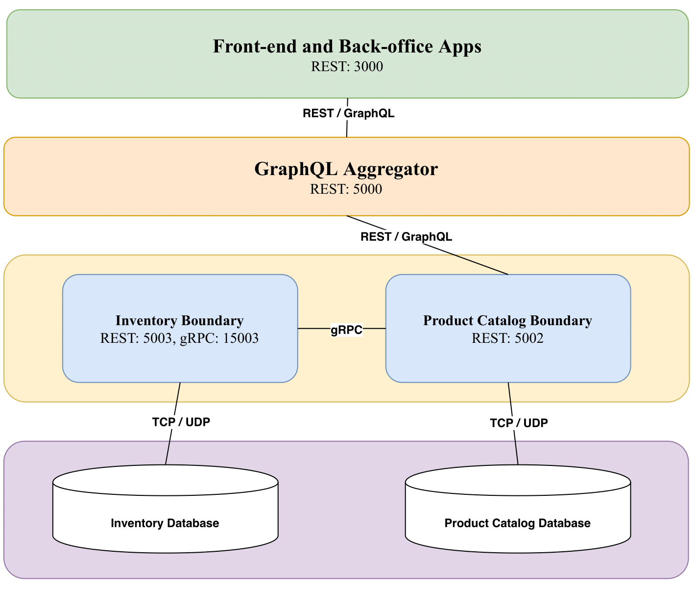

# Developer Guide

## Install pre-requisites

- Docker for Desktop installed with Kubernetes is enabled.
- Follow those steps at https://github.com/dapr/cli to install Dapr CLI.
- Follow these steps at https://github.com/dotnet/tye/blob/master/docs/getting_started.md to install `tye` CLI.
- EF Core CLI

## Building the code

Clone the source code at https://github.com/thangchung/practical-dapr

```bash
$ git@github.com:thangchung/practical-dapr.git
```

## Development

- Step 1: Open up `src\Identity\CoolStore.IdentityServer\appsettings.json`, and turn `IsDev` to `true`
- Step 2: Open up `tye.yaml`, and comment out `name: webui`
- Step 3: At root of project, open up terminal and type `tye run`, and we get `IdentityUrl` and `GraphQLUrl` from the `tye dashboard`
- Step 4: Open up `src\WebUI\CoolStore.WebUI.Host\appsettings.json`, and turn `IsDev` to `true`, and replace `IdentityUrl` with the value at Step 3, and also replace `GraphQLUrl` with the value at Step 3. Final step, change `src\WebUI\CoolStore.WebUI.Host\GraphQL\berry.json` with the `GraphQL` endpoint at the Step 3
- Step 5: Run `CoolStore.WebUI.Host` at the debug mode, then we are ready to develop the `practical-dapr` project.

### One tye command to rule them all

```bash
$ tye run
```

Then you can see `tye dashboard` as below



### Testing it

- Go to `webui`, and on `Bindings` column click to `http` link (http://localhost:58275 in the picture) to access to `Blazor Web UI`
- Go to `identity-api`, and on `Bindings` column click to `http` link (http://localhost:58269 in the picture) to access to `Identity Server 4`
- Go to `graph-api`, and on `Bindings` column click to `http` link (http://localhost:58267 in the picture) to access to `GraphQL Api Server`

#### GraphQL server playground

On the `graph-api` link above, you will be redirected to GraphQL Playground, and you can play with it as following:

```js
query {
    products(
    page: 1
    pageSize: 5
    where: { price_lte: 10000 }
    order_by: { price: DESC }
  ) {
    edges {
      id
      name
      imageUrl
      price
      categoryId
      categoryName
      inventoryId
      inventoryLocation
    }
    totalCount
  }
}
```



#### Mutation

```js
mutation createProductMutation($createProductInput: CreateProductInput!) {
  createProduct(createProductInput: $createProductInput) {
    product {
      id
      name
    }
  }
}
```

```js
{
  "createProductInput": {
    "name": "product 1",
    "description": "this is a description",
    "imageUrl": "https://picsum.photos/1200/900?image=100",
    "price": 100,
    "categoryId": "77666AA8-682C-4047-B075-04839281630A",
    "inventoryId": "90C9479E-A11C-4D6D-AAAA-0405B6C0EFCD"
  }
}
```



# Communication style



## Debugging

Follow steps at [Debugging Dapr application using Tye tool](https://dev.to/thangchung/debugging-dapr-application-using-tye-tool-1djb)

## Distributed logs and tracing

```bash
$ tye run --dtrace zipkin=http://localhost:9411 --logs seq=http://localhost:5340
```

Now, you can access Seq at http://localhost:5340, and Zipkin at http://localhost:9411.

Run serveral queries on `graph-api`, then come back to `Seq` and `Zipkin` UIs, you should see logs and tracing.

## Setup azure cloud services

- [Publish docker image to ACR and AKS](https://docs.microsoft.com/en-us/azure/dev-spaces/how-to/github-actions) and [example](https://github.com/Azure/dev-spaces/blob/master/.github/workflows/bikes.yml)